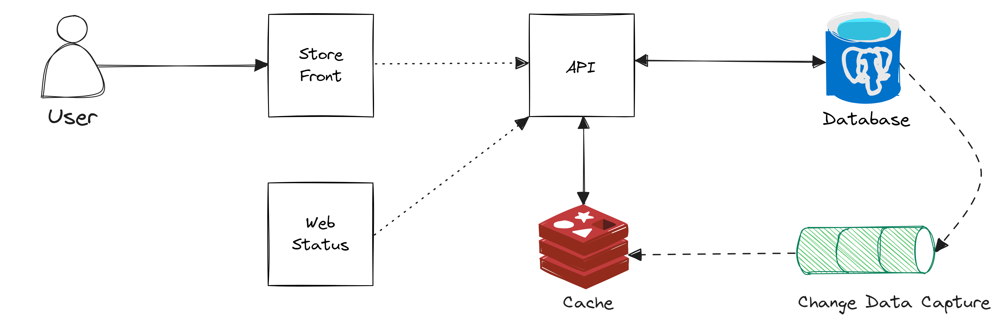

# Drug Store

## Description

<p align="justify">
An application that allows users to search for drugs and get information about them. The application also allows users to search for drugs based on their location and get a list of drug stores that have the drugs in stock.
</p>



## Prerequisites

- [K6](https://k6.io/docs/getting-started/installation/)
- [pnpm](https://pnpm.io/installation)
- [Docker](https://docs.docker.com/get-docker/)
- [Node.js](https://nodejs.org/en/download/)
- [.NET 8.0](https://dotnet.microsoft.com/download/dotnet/8.0)
- [Azure CLI](https://docs.microsoft.com/en-us/cli/azure/install-azure-cli)
- [Azure Subscription](https://azure.microsoft.com/en-us/free/)

## Installation

1. Clone the repository

```bash
git clone https://github.com/foxminchan/DrugStore
```

3. Restore the packages

```bash
cd DrugStore && dotnet restore ./DrugStore.sln
```

4. Set up infrastructure

```bash
docker-compose -f ./docker-compose.yml ./docker-compose.o11y.yaml up -d
```

### Cloudinary Configuration

<p align="justify">
Navigate to the <a href="https://cloudinary.com/console">Cloudinary Console</a> website and create an account. After creating an account, navigate to the dashboard and copy the cloud name, API key, and API secret. Create a file named <code>appsettings.Development.json</code> in the <code>DrugStore.Presentation</code> project and add the following code:
</p>

```json
{
  "CloudinarySetting": {
    "CloudName": "cloud_name",
    "ApiKey": "api_key",
    "ApiSecret": "api_secret"
  }
}
```

## Usage

### Running the application

```bash
dotnet watch -p ./src/Api/DrugStore.Presentation/ run -lp https
dotnet watch -p ./src/Web/DrugStore.StoreFront/ run -lp https
dotnet watch -p ./src/Web/DrugStore.WebStatus/ run -lp https
```

[!NOTE]

If you are using `Tye` to run the application, you can run the following command:

```bash
tye run
```

### Running the tests

For load testing, run the following command:

```bash
k6 run ./k6/performance.js
```

For unit testing, run the following command:

```bash
dotnet test ./DrugStore.sln
```

## Azure Deployment

To deploy the application to Azure, follow the steps below:

1. Login and select the subscription

```bash
az login
az account set --subscription "subscription_id"
```

2. Deploy the infrastructure

```bash
az deployment sub create --location eastus --template-file ./azure/main.bicep
```

3. Login to the Azure Container Registry

```bash
export PASSWORD=YOUR_PASSWORD
echo $PASSWORD | docker login "acr_name".azurecr.io -u "username" --password-stdin
```

4. Build and push the images to the Azure Container Registry

```bash
docker compose build
docker compose push "acr_name".azurecr.io/drug-store-api:latest
docker compose push "acr_name".azurecr.io/drug-store-storefront:latest
docker compose push "acr_name".azurecr.io/drug-store-webstatus:latest
```

5. Get the Azure Kubernetes Service credentials

```bash
az aks get-credentials --resource-group "resource_group" --name "aks_name"
```

6. Deploy the application to the Azure Kubernetes Service

```bash
az deployment group create --resource-group "resource_group" --template-file ./azure/app.bicep
```

7. Open the application

```bash
kubectl get ingress
```

## License

This project is licensed under the MIT License - see the [LICENSE](LICENSE) file for details.
